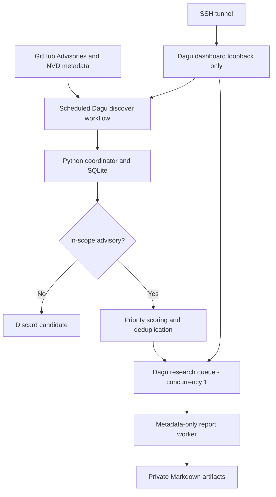

# Slipcage architecture

## Trust boundaries

1. **Control plane**: Dagu runs as the non-root `isolab` user under a systemd cgroup. Dashboard binds to loopback and requires a builtin administrator account. Anyone with access to edit workflows could execute commands as this user; treat dashboard access as shell-equivalent.
2. **Public input**: feed data is untrusted. The Python coordinator has a fixed allowlist of keywords for relevance, stores data in a SQLite database, hashes opaque candidate IDs, and never executes supplied code or shell strings.
3. **Worker**: v0.1 runs only safe metadata review; no Docker socket, KVM access, or guest VM. The worker cannot elevate to root through the chosen service configuration.
4. **Artifact storage**: SQLite and reports are private (`/srv/isolab`, permissions 0700). Backups and retention/quotas are not provided yet.
5. **Escapes**: guest-to-host escape reproduction would target the VPS's nested VM host, potentially threatening the outer hypervisor. Such jobs are disabled pending explicit authorization and suitable isolation.

## Capacity starting points

Host: 6 vCPU, 12 GiB RAM, 180 GB NVMe. Dagu process-tree budget: 5 CPU-equivalents and 10 GiB RAM, leaving ~2 GiB RAM for OS and overhead. `metadata` and `research` queues each have concurrency 1. There is no active fuzzing, so these limits are ceilings rather than predicted loads. Future fuzzing should have stricter job-level limits, disk quotas, and snapshots.

## Future job statuses

`discovered -> deduplicated -> prioritized -> queued -> triaged -> [approved build/experiments] -> validated / invalid / needs-review`

Starter implements `pending -> queued -> reviewed` only. It does not classify a crash as an escape or claim the presence of a vulnerability. Failures during execution may leave `queued` items that require a manual review/reset; automatic reconciliation is deferred.

## Roadmap

- Phase 0 (this package): repeatable deployment, localhost UI, discovery, scoring, bounded queue, safe reports.
- Phase 1: artifact cleanup, alerting, health and performance metrics, read-only code/patch diffing, synthetic regression fixtures.
- Phase 2: permitted isolated QEMU source builds, virtual-device fuzzing, container scanning, crash triage, fixed-corpus testing.
- Phase 3: separately authorized escape validation on an appropriate sacrificial host, disclosure workflow, and a searchable findings UI (PocketBase optional).

## Documentation and release references

- https://docs.dagu.sh/getting-started/installation/linux
- https://docs.dagu.sh/server-admin/queues
- https://docs.dagu.sh/server-admin/authentication/builtin
- https://github.com/dagucloud/dagu/releases/tag/v2.18.1
- https://www.qemu.org/docs/master/devel/testing/fuzzing.html
- https://docs.github.com/en/rest/security-advisories/global-advisories
- https://nvd.nist.gov/developers/vulnerabilities

## Deployment barrier

Each reviewed DAG calls a shared-lock wrapper for the entire experiment.
Ansible creates a maintenance marker, prevents new experiments, waits for
all existing experiments to drain under an exclusive lock, applies updates,
flushes service restarts, checks service health, and resumes. A timeout
aborts the update; a later failure leaves maintenance enabled. Some queued
or scheduled jobs may need reconciliation; this is a requirement before
automating long-lived research experiments.
